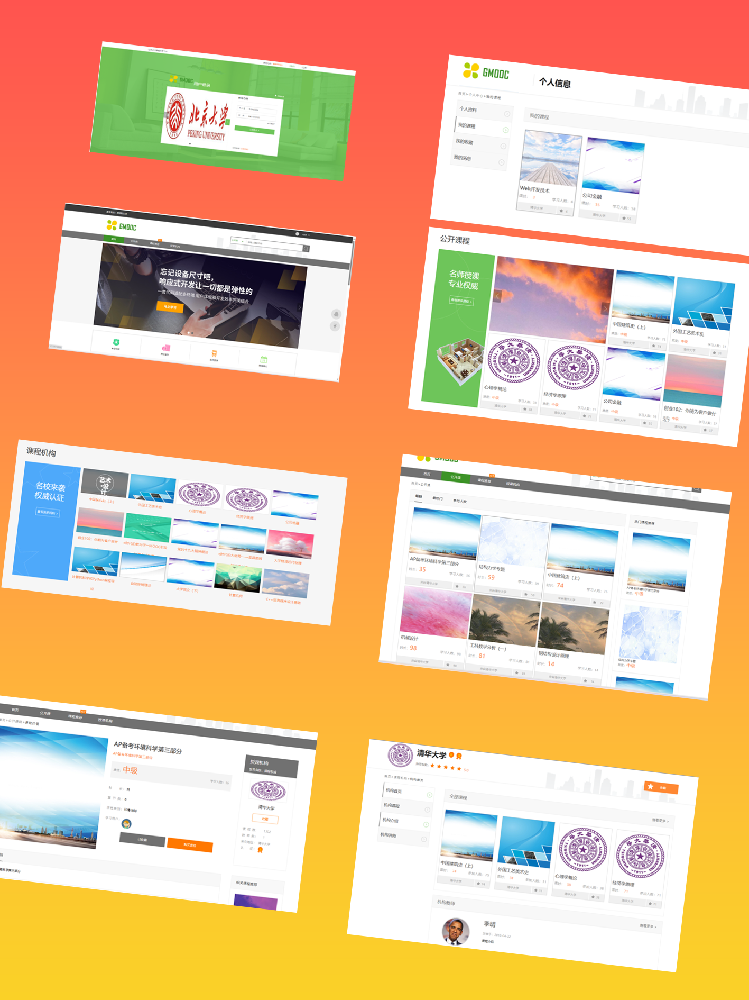
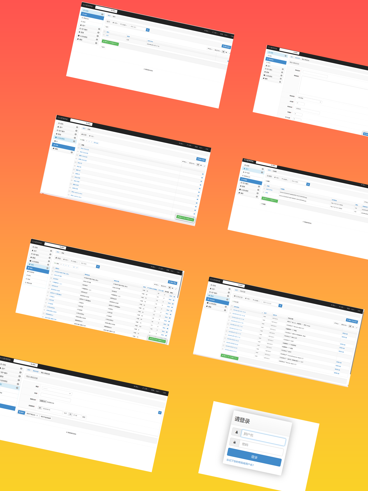
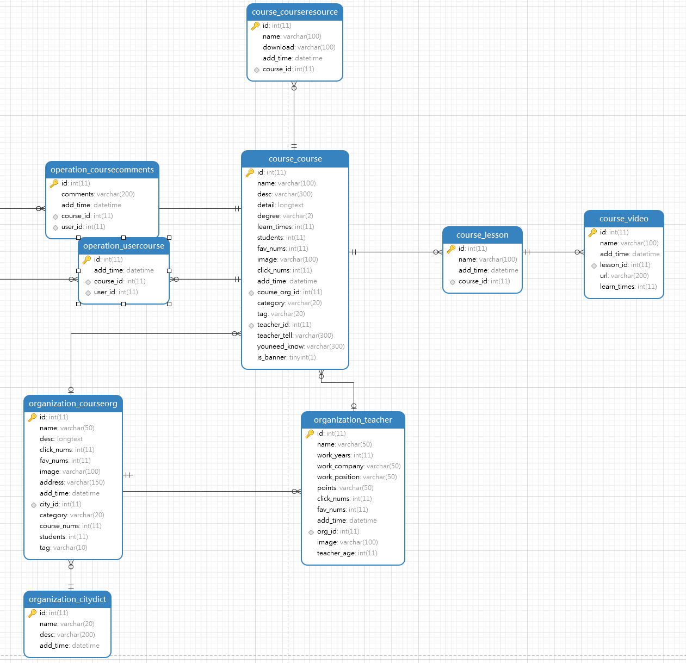
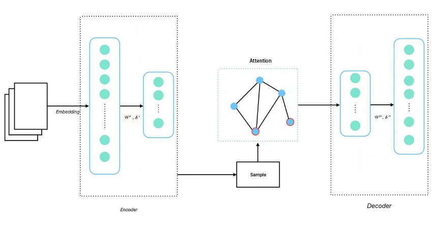

# Online Course Recommendation System

Welcome to the **Online Course Recommendation System**! This project aims to create an intelligent recommendation system for online education, with a strong focus on AI-driven recommendations and real-time optimizations.

---

## 📸 **Demo:**

#### **Client Demo (Desktop View)**

#### **Admin Demo (Mobile View)**

---

## 📝 **Comprehensive Features:**

- **Course search, browsing, and evaluation**: Seamlessly search and explore courses.
- **Course recommendation**: Personalized recommendations based on user preferences and interactions.
- **Purchase integration**: Enable users to purchase courses directly from the platform.
- **User behavior analysis**: Deep insights into user behavior to optimize recommendations.

---

## ⚙️ **Advanced Backend & Frontend Technology:**

- **Backend**: Powered by **Django**, providing a clean and efficient framework for managing backend logic.
- **Frontend**: Lightweight and responsive UI built using **HTML** and **CSS**.
- **Database**: A reliable **MySQL** database for efficient data storage and management.

---

## 🤖 **Innovative AI Techniques:**

- Utilizes state-of-the-art **deep learning techniques**, including:
  - **Reinforcement Learning** and **Contrastive Learning**.
  - **Graph Neural Network (GNN)** with attention mechanisms to aggregate neighbor node features.
  - Multi-level **denoising functions** for improving recommendation accuracy.
  
---

## 📊 **Data-Driven Optimization:**

- Leverages an open **MOOC dataset** and **user interaction data** for continuous optimization.
- Solves the **cold start problem** effectively using **adaptive learning** techniques.

---

## 🔗 **Unified Representation Framework:**

- Constructs a unified **heterogeneous graph** of **user-course interactions**:
  - Focus on the interrelations between **users**, **knowledge**, and **courses**.
  - Enhanced representation learning for more accurate and relevant recommendations.

---

## 🔬 **Experimental Validation:**

- Designed and tested an **offline recommendation engine** on real-world educational datasets.
- Achieved **performance** comparable to cutting-edge recommendation algorithms.

---

## 🚀 **Practical Application:**

- Developed a **multi-stage recommendation pipeline** prototype:
  - Tailored specifically for **real-world online education scenarios**.
  - Balances **heavy deep learning computations** with **lightweight online recommendations**.

---

## 🖥️ **System Design:**

Before you begin, ensure you have met the following requirements:

#### **Database Structure:**

---

#### **Course Recommendation System (CRS) Database Architecture:**

---

#### **Network Design:**

---
